<!--
Standalone UX heuristic audit, 2026-09-23. This is an investigation and
report only -- no app code, copy, or prompts were changed while producing
it. It does not update docs/PROJECT_STATUS.md or docs/latest-summary.md;
if any of this is acted on, log that separately in the normal place.
-->

# UX Heuristic Audit — Positive Inking Intake Journey (2026-09)

Full walkthrough of the client intake journey, Welcome through Blueprint,
against an 8-point checklist (clarity of intent, tone, consistency,
navigation clarity, cognitive load, reassurance/trust signals,
accessibility basics, output resonance), read through 6 client avatar
lenses. Investigation only — every finding below is a report, not a
change; nothing in `engine/`, `server/`, or `web/` was touched.

## Method

Walked the journey live against the real server + Vite dev server + the
`test-integration/fakeAnthropic.mjs` double (same pattern as this
project's other live-verification scripts), using a throwaway Playwright
driver (not checked in — this report and its screenshots are the only new
files from this session). Two fixture journeys, screenshotting every
screen reached:

- **Journey A — straightforward.** A concrete, specific story (a
  grandmother's cooking Sundays and a torn blue apron) that does **not**
  trigger the meaning-depth gate. Screenshots: `journeyA-straightforward-*`.
- **Journey B — depth gate.** A deliberately vague, generic story ("something
  meaningful, I guess... just because I like it") that **does** trigger the
  gate, answered with an equally thin follow-up. Screenshots:
  `journeyB-depthgate-*`.

All screenshots live in `docs/ux-audit-assets/`. Both journeys used the
same viewpoint, Screen-7 decisions, and later-screen answers so the two
runs are comparable; only the story text, the depth-gate interaction, and
the Screen-7 detail follow-up answer ("her blue apron, the one with the
small tear near the pocket" vs. a blunt "no") differ between them.

**Two honest limitations of this method, stated up front so findings below
aren't misread:**

1. **Generated prose is fake-double fixture text, not real model output.**
   The fake Anthropic double is stateless and returns fixed fixture prose
   keyed off which tool was called, not off the actual story text (see
   `fakeAnthropic.mjs`'s own design). Concretely: the Meaning Reflection
   quote in this run literally reads *"Response for: The user selected the
   viewpoint 'past' before telling their story. Retain it as
   primary_viewpoint..."* — the raw system-instruction text, echoed back
   verbatim — and the Statement of Inspiration is literally prefixed *"Test
   statement of intention: ..."*. Both are the fake double intentionally
   surfacing what it was told, not a tone or clarity bug in the app. The
   two journeys' final Blueprints are word-for-word identical except for
   the one line that carries the user's own typed text — confirmed by diffing
   `journeyA-straightforward-blueprint-text.txt` against
   `journeyB-depthgate-blueprint-text.txt`. **This means "Output resonance"
   (checklist item 8) cannot be genuinely evaluated by this method** — see
   that section below. Everything else audited (static UI chrome:
   headings, instructions, button labels, layout, the depth-gate's own
   framing, form structure) is real app code and is evaluated normally.
2. **Reference-photo upload and voice-input paths were exercised only
   structurally.** Both journeys reach Placement's two upload slots and see
   the consent checkbox render correctly, but neither actually attaches a
   file (matches this project's existing "photo-upload personas are v2
   scope" position from the adjacent persona-harness work). Voice input's
   own affordance was seen (button present, labelled) but not invoked —
   text-equivalent phrasing stands in, consistent with how the rest of this
   project's live-verification tooling treats voice.

## Findings by screen

### 1. Welcome
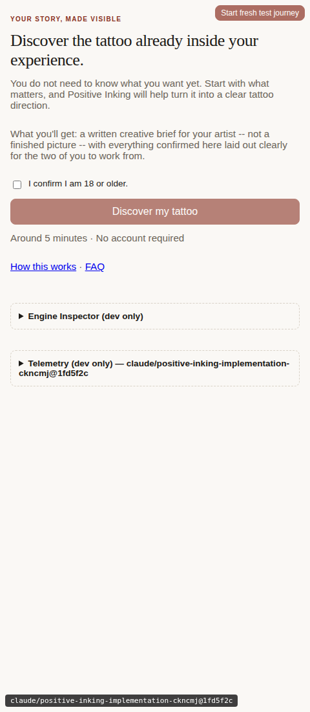

- **Clarity (strength):** "Discover the tattoo already inside your
  experience" plus the explicit "What you'll get: a written creative brief
  for your artist — not a finished picture" sets expectations precisely
  before anything is asked. A first-timer knows exactly what kind of
  output they're working toward.
- **Reassurance/trust (finding):** The only links on this screen are "How
  this works" and "FAQ" — there is **no link to a privacy notice anywhere
  in the live app**. `docs/positive-inking-privacy-notice.md` exists and
  the individual consent mechanisms it describes (18+ checkbox here, photo
  rights checkboxes at each upload point) are correctly implemented and
  wired up — confirmed by grepping `web/src` for "Privacy": every hit is a
  code comment citing the notice as its own source of truth, none is a
  user-facing link or route. A **privacy-anxious** user who wants to read
  the actual policy before checking the age box has no way to do so without
  leaving the product. *Suggested direction: a "Privacy" link alongside "How
  this works · FAQ" here, and/or at each consent checkbox, pointing to a
  rendered version of the existing notice.*
- **Tone:** warm throughout, no pressure language. Age gate is a single
  plain checkbox with clear copy, not a modal or interstitial.

### 2. Viewpoint
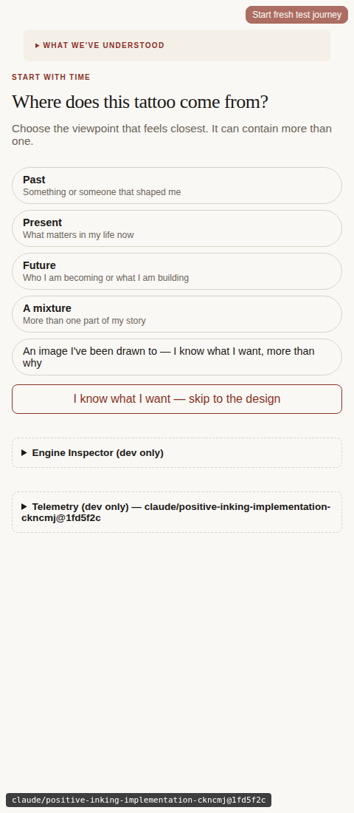

- **Clarity (strength):** "Where does this tattoo come from?" with five
  well-differentiated chip choices, each with a one-line gloss.
- **Cognitive load (strength):** "I know what I want — skip to the design"
  is a genuine escape hatch, not buried. Directly serves the **experienced
  collector** avatar who finds depth questions slow.
- No progress indicator yet — reasonable this early (see Screen 7 finding
  below for why this becomes a problem later, not here).

### 3. Story
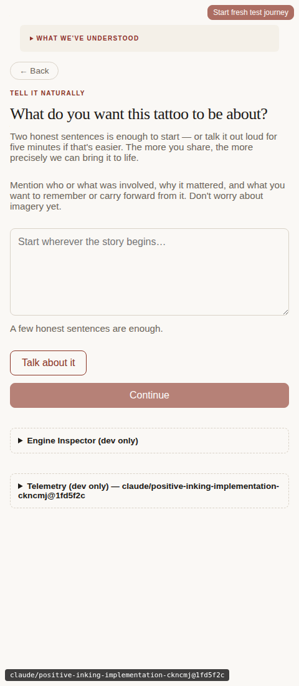

- **Tone (strength):** "Two honest sentences is enough to start... Mention
  who or what was involved, why it mattered, and what you want to
  remember or carry forward. Don't worry about imagery yet." This is
  concrete guidance without being clinical — it tells a first-timer what
  "enough" looks like without demanding a specific structure.
- **Cognitive load:** the textarea has no visible max-length warning, only
  a soft "A few honest sentences are enough" hint beneath — doesn't punish
  an **over-sharer** who goes long; good.
- A prior session (2026-09-11, per `Story.test.tsx`'s own comment)
  deliberately removed a sensitive-information disclosure that used to sit
  here. Noted for context, not re-raised as a new finding — that was a
  considered decision already logged elsewhere.

### 4. Meaning-depth gate (Journey B only)
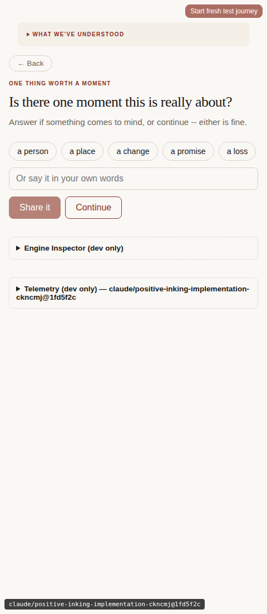
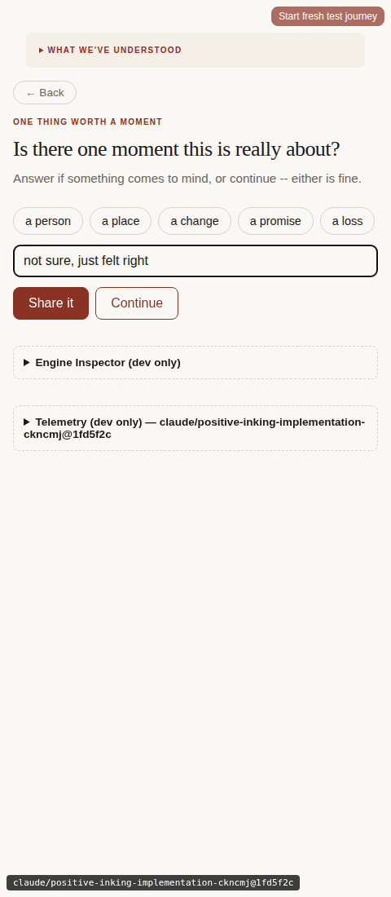

- **Tone (strongest finding in the whole audit, in the positive direction):**
  "Is there one moment this is really about?" / "Answer if something comes
  to mind, or continue — either is fine." The category chips ("a person,"
  "a place," "a change," "a promise," "a loss") are evocative rather than
  procedural, and "Continue" sits as an equally-weighted button right next
  to "Share it" rather than a small de-emphasized skip link. This is
  exactly the gentle, non-mandatory framing the checklist's tone criterion
  asks for — it does not read as being cross-examined. This matters most
  for the **first-timer with an emotionally loaded story** and the
  **privacy-anxious** avatar, both of whom would be most sensitive to a
  follow-up question feeling like an interrogation.
- Caveat: per the method limitation above, this only verifies the gate's
  static framing is gentle — not that the real model's generated
  `depth_prompt` text (which this fake double doesn't produce) stays
  equally gentle across genuinely varied inputs. Worth a real-model spot
  check.
- **Minor (over-sharer avatar):** the follow-up's own answer field is a
  single-line `<input>`, not a textarea. Someone who wants to elaborate at
  length in response to "is there one moment this is really about" is
  mildly constrained by the field shape, even though nothing stops them
  from typing a long answer into it.

### 5. Meaning Reflection & Statement of Inspiration
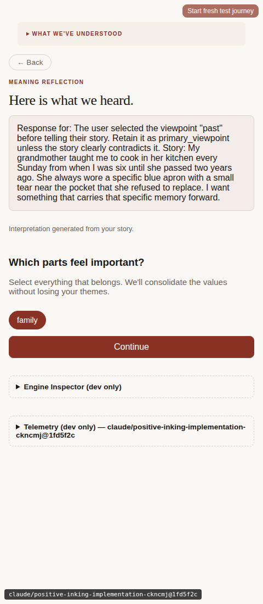
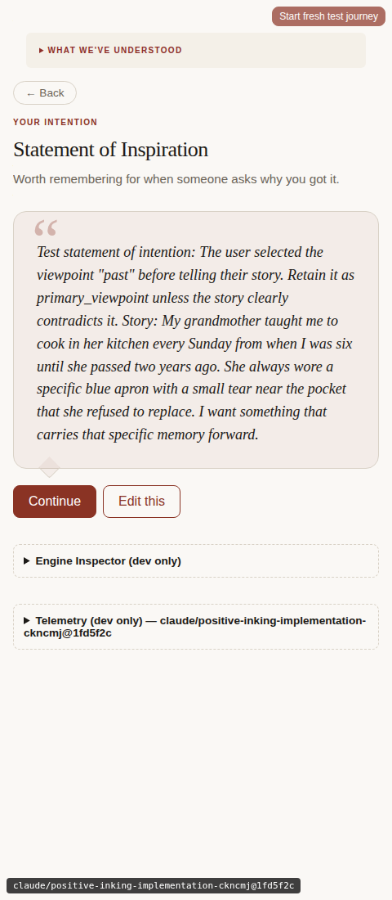

- Static chrome (headings, "Which parts feel important?", the "Edit this"
  correction button) is clear and consistent with the rest of the app.
- **Output resonance not assessable here** — see the Method section; the
  quoted text in both screens is fake-double fixture/test text in this
  run, not real generated prose.
- **Strength:** "Edit this" on the Statement of Inspiration gives an
  explicit, visible correction path before committing forward — good for
  any avatar who feels the reflection missed the mark.

### 6. Elements Discovery (Screen 7)
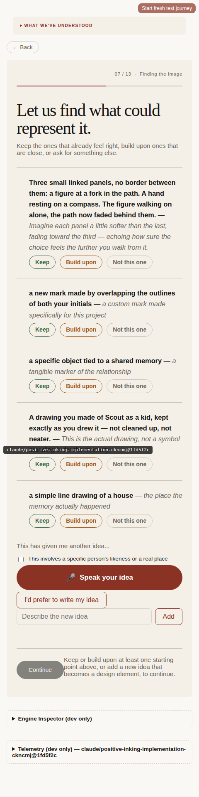
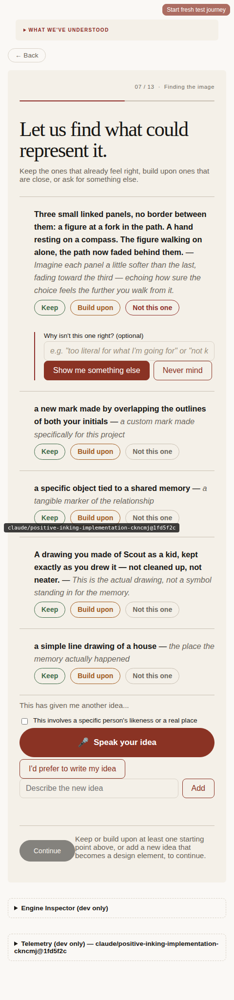
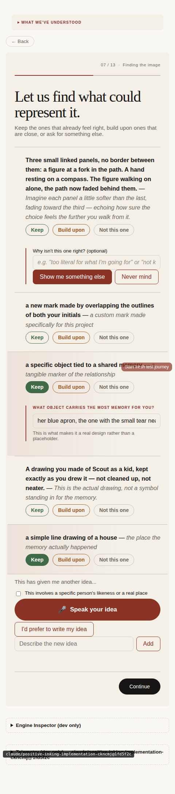

- **Clarity (strength):** "Keep the ones that already feel right, build
  upon ones that are close, or ask for something else" is a precise,
  concrete instruction for a screen that's doing a lot (5 candidates × 3
  actions each).
- **Accessibility (pass):** Keep / Build upon / Not this one are each a
  distinct color **and** carry their own text label — nothing here relies
  on color alone to convey state. Kept/undecided states are additionally
  distinguished by fill vs. outline, a second non-color signal.
- **Navigation clarity / consistency (finding):** this screen shows a
  progress indicator — "07 / 13 · Finding the image" — that **appears on
  no other screen in either journey**, before or after. Screens 1–6 have
  none; screens 8–13 (Creative Control through Design Confirmation) also
  have none. A progress cue that shows up once and then vanishes for the
  rest of the journey briefly promises ongoing progress tracking and then
  breaks that promise — arguably more disorienting for the **experienced
  collector** (who most wants "how much longer") than having no indicator
  at all. *Suggested direction: either extend a consistent "N / 13" (or
  simplified step) indicator to every screen, or remove it from this one.*
- **Reassurance (strength):** the "Why isn't this one right? (optional)"
  box is explicitly optional and framed as an invitation, not a demand for
  justification — good for a **skeptical** user who might resent being
  asked to defend a preference.
- **Cognitive load (finding, moderate):** with a candidate Kept, this
  screen simultaneously shows: 5 candidate cards × 3 buttons, an open
  why-box, a follow-up detail input, an "add your own idea" section with a
  voice button, a relationship/likeness checkbox, and a manual text-entry
  toggle — all live in view at once for a **less tech-comfortable** or
  first-time user. Nothing here is individually confusing, but the total
  is a lot to parse on first encounter. *Suggested direction: consider
  collapsing not-yet-relevant controls (e.g., the "add your own idea"
  block) until the visible 5 candidates are at least partially resolved.*
- **Minor, dev-only cosmetic (not a client-facing issue):** the fixed-position
  "Start fresh test journey" dev button visibly overlaps candidate text
  when the page is tall enough (visible in the "decided" screenshot
  above, over "a specific object tied to a shared memory"). This lives in
  `web/src/dev/StartFreshJourneyButton.tsx` and is dev-only tooling, not
  part of the production build — noted for completeness, not prioritized.

### 7. Creative Control, Rough Scale
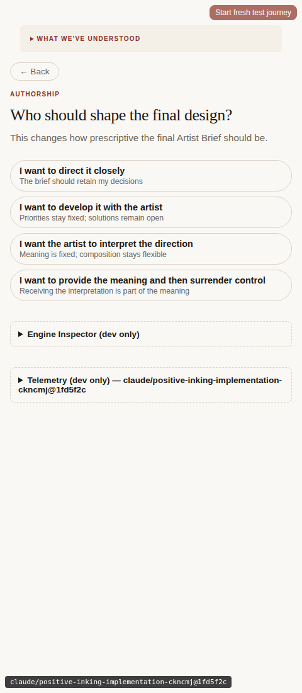
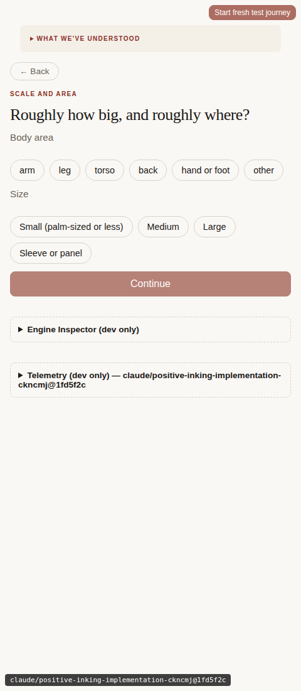

- Both are clean, single-question chip screens consistent with the studio-
  ledger language established on Screen 1. "Who should shape the final
  design?" — with its "This changes how prescriptive the final Artist
  Brief should be" subtext — is a good example of explaining *why* a
  question matters before asking it, directly serving Clarity of intent.

### 8. Composition & Background, Style Reference, Artistic Direction
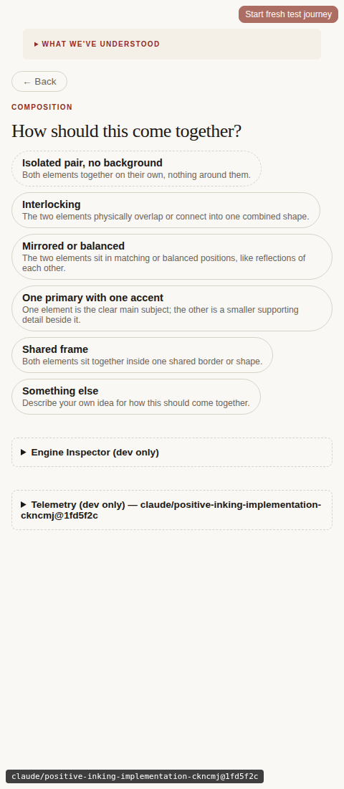
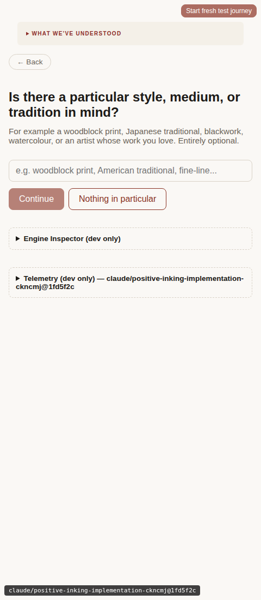
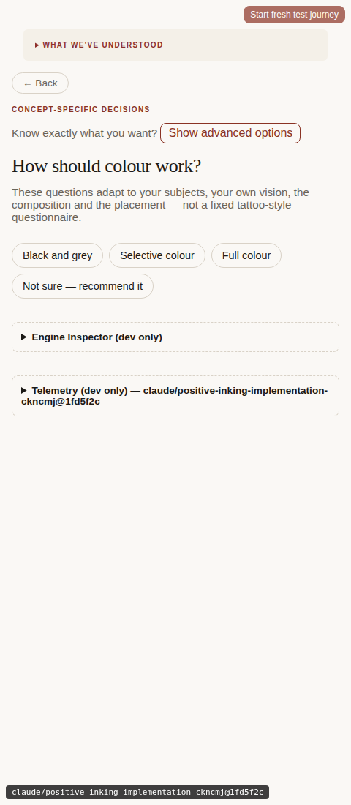

- **Reassurance (strength):** Style Reference's "Entirely optional" is
  stated directly in the instruction copy, not just implied by a skip
  button — reduces pressure on a user with no strong preference (serves
  the **skeptical** avatar well: nothing here pretends a preference is
  required).
- **Cognitive load (strength):** Artistic Direction's "Show advanced
  options" toggle and "Not sure — recommend it" fallback chip are good
  progressive-disclosure and decision-fatigue accommodations — directly
  useful for the **less tech-comfortable** avatar.
- Tone and heading style stay consistent with every other screen; no drift
  into a different register anywhere in this stretch.

### 9. Avoidances
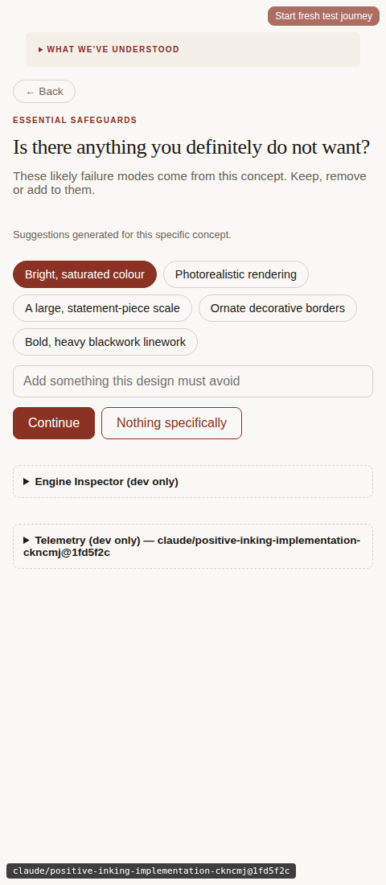

- **Personalization (strength):** "Suggestions generated for this specific
  concept" with concept-specific chips (e.g., "Bright, saturated colour,"
  "Photorealistic rendering") rather than a generic checklist — reinforces
  that the app is tracking the actual project, a small but real signal
  against the "just generic AI" skepticism this checklist asks to watch
  for.
- Free-text field plus "Nothing specifically" skip — same low-pressure
  pattern as Style Reference.

### 10. Placement
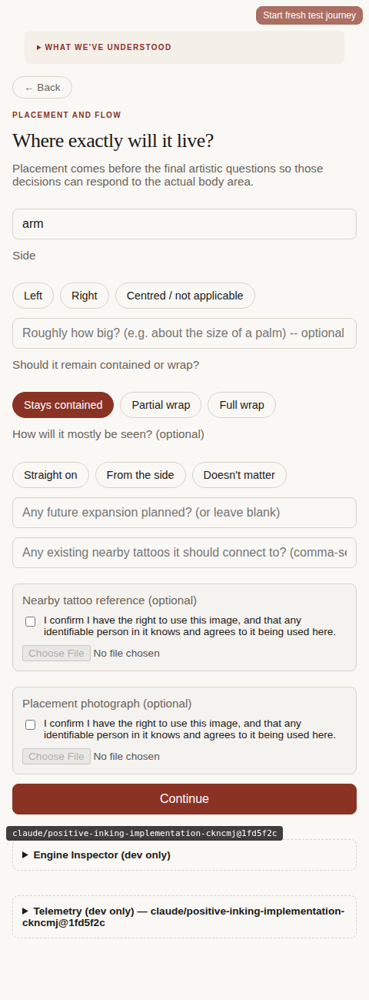

- **Reassurance/trust (strength):** both optional upload fields ("Nearby
  tattoo reference," "Placement photograph") carry the photo-rights
  consent checkbox ("I confirm I have the right to use this image, and
  that any identifiable person in it knows and agrees to it being used
  here") directly beside the file input, gating it — the reassurance
  signal is present exactly where it's needed most, at the point of
  highest sensitivity for a **privacy-anxious** user asked to upload a
  photo of someone else.
- **Clarity (strength):** the body-area field is pre-filled from the Rough
  Scale answer ("arm") as editable text rather than re-asking — good
  continuity, avoids re-confirming what the user already said.

### 11. Design Confirmation ("Ready to build your Blueprint")
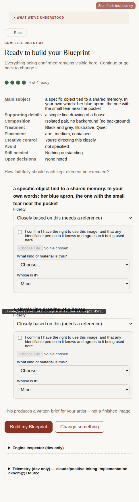

- **Clarity/navigation (strength):** "Everything being confirmed remains
  visible here. Continue or go back to change it" is a clear, honest
  statement of what this screen is and what Back does from here — a good
  answer to the checklist's "is it ever unclear what Back/Resume will
  actually do" question, at least locally on this screen.

- **🐞 BUG (not a UX judgment call) — Screen 7 "Keep" leaves `reference_status`
  out of sync with `fidelity`, so the Blueprint can silently under-report
  what still needs a reference photo.**

  Reproduced identically in both audit journeys. What happens:

  1. On Screen 7, clicking **Keep** on any candidate sets
     `fidelity: "closely_based_on"` by default
     (`web/src/screens/ElementsDiscovery.tsx:711`,
     `defaultFidelity = decision === "keep" ? "closely_based_on" : "interpretive"`).
     `"closely_based_on"` is a member of `NEEDS_REFERENCE`
     (`web/src/journey/referenceDraft.ts:14`), so this is correctly a
     "needs a reference" fidelity.
  2. The very same Keep action independently defaults
     `reference_required: false` and `reference_status: "not_needed"`
     (`ElementsDiscovery.tsx:725-726`) — **not derived from the fidelity
     it just set**, just a hardcoded fallback.
  3. The only place that reconciles these two fields is Screen 13's
     Fidelity `<select>` `onChange` handler
     (`web/src/screens/DesignConfirmation.tsx:82`, which calls
     `statusFromDraft(fidelity, ...)`). It only runs on an explicit
     `onChange` — if the user never touches a dropdown that's *already*
     showing the correct "Closely based on this (needs a reference)"
     value (the overwhelmingly likely path: why would you touch a select
     that already shows what you want?), the stale defaults from step 2
     are never corrected.
  4. Result, confirmed in both journeys' Blueprints: Section 10
     ("References and open decisions") reads **"— Not needed"** for an
     element the Fidelity dropdown on the immediately preceding screen
     displayed as *"Closely based on this (needs a reference)."* Section
     12's Readiness dashboard compounds it, reporting **"References: None
     required for this concept."**

  This is a real internal-consistency bug, not a wording/tone call: two
  fields that are supposed to describe the same fact
  (`NEEDS_REFERENCE.has(fidelity)` vs. `reference_status`) disagree by
  default, and the disagreement survives all the way into the artist-facing
  document. A client who accepts the default fidelity and never opens the
  dropdown gets a Blueprint that quietly tells their artist nothing is
  needed, when the app itself just displayed the opposite. *Not fixed in
  this session, per the audit's scope — flagged for a follow-up fix.*

### 12. Blueprint (final)
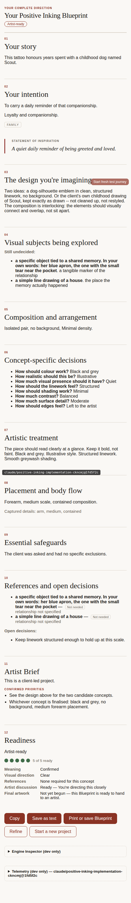
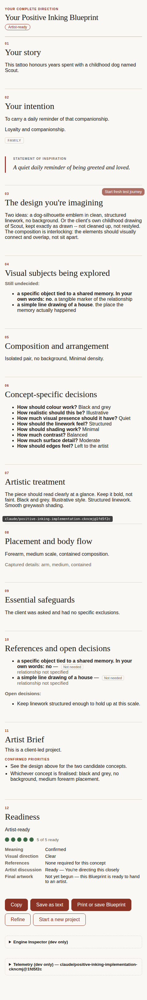

- Structure is thorough and professional: 12 numbered sections plus a
  5-component Readiness dashboard, an "Artist-ready" badge, and clear
  export actions (Copy / Save as text / Print or save / Refine / Start a
  new project).
- **Output resonance — not assessable by this method (flagged, not
  scored).** Diffing the two full Blueprint texts
  (`journeyA-straightforward-blueprint-text.txt` vs.
  `journeyB-depthgate-blueprint-text.txt`) shows they are **identical**
  except for the one line carrying the user's own typed detail answer
  ("her blue apron, the one with the small tear near the pocket" vs. a
  blunt "no") — every other line, including "Your story," "Your
  intention," the Statement of Inspiration, and the entire Artistic
  Treatment section, is word-for-word the same across two deliberately
  very different fictional client inputs (one concrete grandmother story,
  one vague "something meaningful, I guess"). This is expected given the
  fake double's design (Method limitation #1 above) and is **not**
  evidence the real app produces generic output — but it also means this
  audit genuinely cannot confirm the opposite. *Recommend a dedicated
  real-model pass — reusing 2-3 of the persona-harness fixtures from
  `test-integration/personas/` against the real Anthropic API — specifically
  to check whether Blueprint prose is meaningfully distinct across
  different Discovery inputs, which is exactly the **skeptical user
  testing whether the app is "just generic AI"** avatar's core question.*
- The Section 10/12 reference-status bug from Design Confirmation is
  visible here in both journeys, as described above.

## Prioritized top 5

1. **🐞 Fix (bug, not UX call): Screen 7 Keep → Screen 13 `reference_status`
   desync.** Highest priority — this is a data-integrity issue that can
   hand an artist an inaccurate Blueprint by default, not an edge case
   (reproduced on the very first straightforward run of this audit).
2. **Add a visible link to the privacy notice somewhere in the live app**
   (Welcome screen and/or each consent checkpoint). The individual consent
   mechanisms are well-built; the policy they implement is currently
   undiscoverable from inside the product itself.
3. **Resolve the progress-indicator inconsistency.** Either extend "N / 13"
   to every screen or remove it from Screen 7 — showing it exactly once
   currently sets and then breaks an expectation.
4. **Commission a real-model verification pass on Blueprint output
   diversity.** This audit's method cannot distinguish "the app produces
   generic output" from "the fake double always does" — that gap should be
   closed with real API calls before treating output resonance as settled
   either way.
5. **Consider progressive disclosure on Screen 7** for less-tech-comfortable/
   first-time users — the fully-expanded state (5 candidates × 3 actions,
   an open why-box, an "add your own idea" block) is a lot to take in on
   first arrival, even though no individual piece is unclear.

## What this audit did not cover (by design)

Matches the adjacent persona-harness's own stated v2 scope, for the same
reasons: reference-photo files were never actually attached (only the
consent-gated upload UI was seen), voice input was seen but not invoked,
and no back-navigation-via-panel path was walked. None of these looked
concerning from what was visible in this pass, but none were exercised
enough to say so with confidence — worth a dedicated pass if this audit is
extended.
